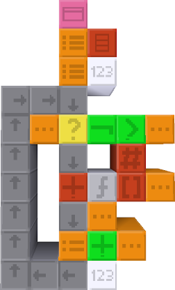

Scriptblocks 2
==============

Scriptblocks 2 is a Minetest mod and toy programming language using nodes called scriptblocks. Scriptblocks are nodes which can be used to build reusable programs.

## Features

* Support for nested expressions and variables.
* Custom, named procedures with up to 2 named parameters and dynamic scoping.
* First-class lists, dictionaries, and lexically scoped closures with up to 1 named parameter.
* Coroutines, closures that can be paused and resumed.
* Processes can run for more than one tick.
* Ability to interface with digiline networks.

## Experiments

* Spawnable processes, enabling pre-emptive multitasking.
* Introspective blocks for debug purposes, such as one to report a string representation of the call stack.

These features can be accessed through the 'Enable Experiments' setting. Some of these features can cause a lot of lag, even with the limits that have been imposed. Others are only useful for debugging purposes. Either way, don't enable these on a server!

## Findings

This mod began as an experiment to see what kind of fully-fledged programming language you can design using nodes. I discovered that creating a language this way has unique advantages, and leaned into them.

* Code reuse and cooperation. You can build a procedure and reuse it in any other script in that world, even if it's part of a completely different project. Other players can even use your procedure for their own scripts. This potential for free, live cooperation between programmers is unmatched by Scratch, Snap! or any other visual programming environments.
* Complex control flow using simple abstractions. Using a custom call stack enables the implementation of powerful control flow mechanisms such as continuations. Coroutines are simply "suspendable procedures" - but when you can make clones of them, they are as powerful as multi-shot delimited continuations (in other words, *very* powerful!).
* Taking advantage of the medium. There is no "while" block - you can create loops by physically *looping* scriptblocks like you would a flowchart. If you want to build a recursive procedure that runs a bit of initialization code at the beginning, you can create a private procedure that 'starts' after the initialization and use that to perform recursion.
* Supporting both imperative and functional paradigms. Reporting from a procedure is implicit, so you can build procedures in a purely functional manner. "Command" blocks are simply reporters that evaluate their next block on their last step, so you can even mix expressions with statements.

## Examples

This procedure calculates the factorial of a given number.

This procedure takes a list and a closure. It calls the closure for each item in the list, and reports the results in a new list.

